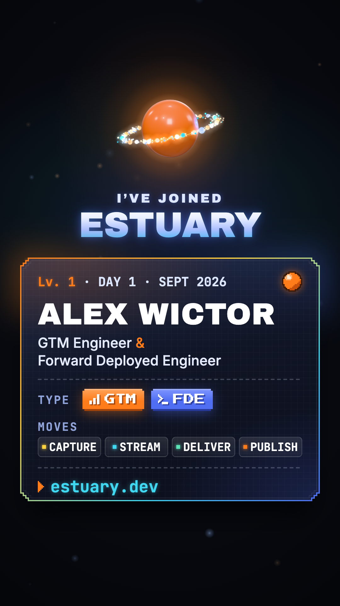

# Estuary announcement video

A 25-second vertical video announcing that I joined [Estuary](https://estuary.dev) as a GTM Engineer & Forward Deployed Engineer. Every frame and every sound is generated by code. There's no stock footage, no samples, and no AI video or voice.



**Watch it:** [media/estuary_announcement.mp4](media/estuary_announcement.mp4)

## The idea

It opens as an original homage to handheld pixel-art RPGs. A new record appears, gets captured, streamed and delivered, and then Alex "evolves" into a modern HD 3D reveal and a trainer-card end screen.

## How it's built

- **[Remotion](https://www.remotion.dev)** renders React components frame by frame into video.
- **[Three.js](https://threejs.org) via React Three Fiber** does the 3D. It's rendered at 270×480 and upscaled for the pixel sections, then at full HD for the reveal.
- **A small software pixel renderer** (`src/scenes/battle_px.ts`) draws all the battle-screen sprites and effects.
- **An original chiptune score and all sound effects** are synthesized from raw waveforms with numpy (`audio/soundtrack.py`).
- **One shared timeline** (`src/timeline.json`) drives both the visuals and the audio, so every sound lands on its frame.

Built with Claude (Anthropic's Opus model) in Claude Code.

## Render it yourself

```bash
npm install
npm run render                                          # silent video -> out/video_silent.mp4
pip install numpy imageio-ffmpeg && npm run soundtrack  # audio -> audio/soundtrack.wav
ffmpeg -i out/video_silent.mp4 -i audio/soundtrack.wav -map 0:v -map 1:a -c:v copy -af volume=-0.6dB -c:a aac -b:a 256k -shortest -movflags +faststart out/final.mp4
```

`npm run studio` opens the Remotion Studio preview.

## Layout

| Path | What |
|---|---|
| `src/timeline.json` | every segment, text line and event frame (30 fps) |
| `src/theme.ts`, `src/ui.tsx` | fonts, palette, shared pixel UI (dialogue box, chapter titles, pills) |
| `src/scenes/Battle.tsx`, `battle_*.ts` | the pixel battle screens and evolution |
| `src/scenes/Pixel3D.tsx`, `pixel3d_*.tsx` | title screen, pixelated 3D river and checkmark |
| `src/scenes/HD.tsx`, `hd_*.tsx` | pixel-to-HD resolve, reveal and end card |
| `audio/soundtrack.py` | the soundtrack generator |

Remotion is free for individuals; see its [license](https://www.remotion.dev/license) for company use.
